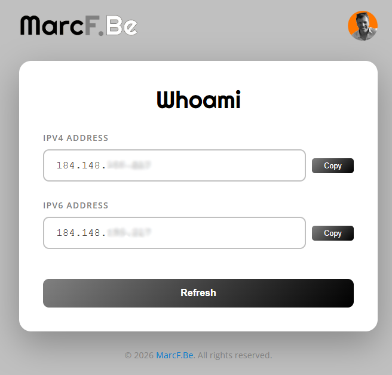

# Whoami

A simple web application that displays your public IPv4 and IPv6 addresses. Useful for quickly checking your current IP address.

https://whoami.marcf.be

## Deployment

This site is hosted on GitHub Pages at [whoami.marcf.be](https://whoami.marcf.be).

## Contributions

All contributions are welcome! Read our [Contribution Guidelines](CONTRIBUTING.md), fork this repo, and create a pull request.

## Attribution

IP address data provided by [ipify.org](https://www.ipify.org/).

## About

Made with ❤ in Canada

Copyright 2026 Marc Bernard

Follow [@marcf.be](https://bsky.app/profile/marcf.be) on Blueksy and [@marcfbe](https://linkedin.com/in/marcfbe) or LinkedIn

